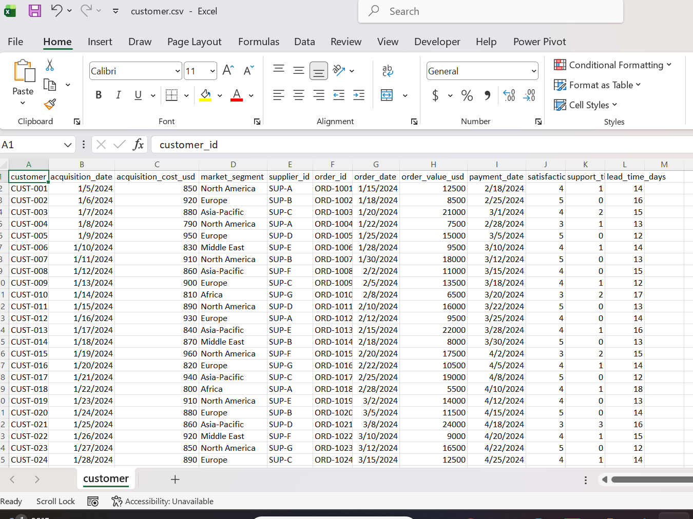
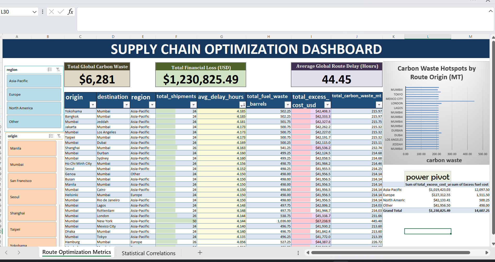
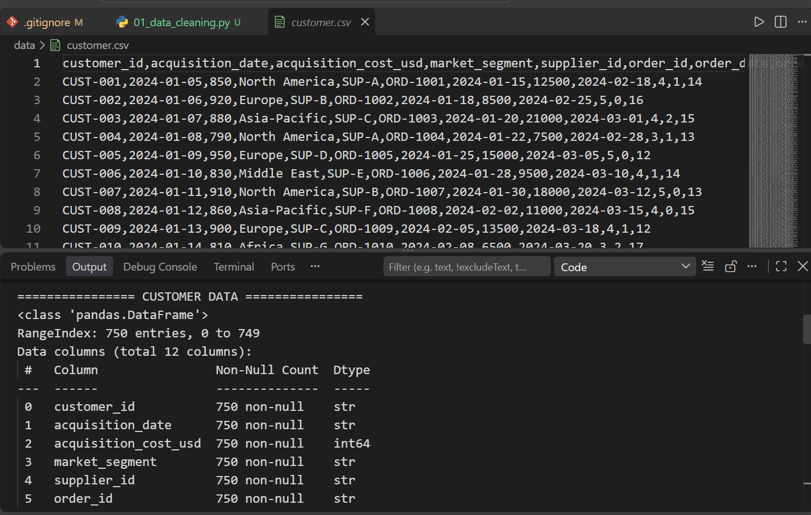
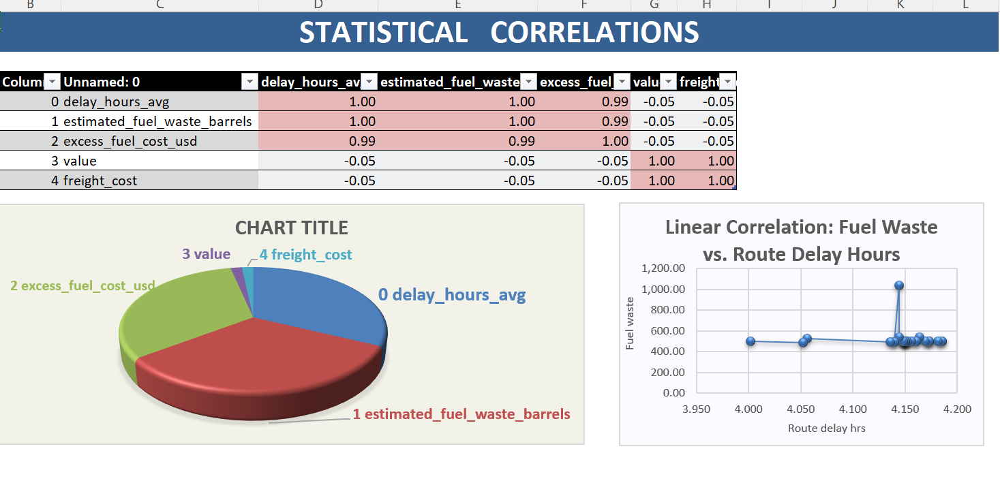

# 🚢 Supply Chain Logistics & Carbon Footprint Optimization

## 💼 Business Problem
A global logistics enterprise experienced severe bottleneck delays and escalating operational fuel costs across critical international trade paths. This project provides an automated data pipeline that cleans unstructured logistical tracking inputs, performs correlation modeling on route delays, and outputs an interactive executive dashboard evaluating environmental carbon waste and financial impacts.

## 🛠️ The Data Engineering & Analytics Stack
- **Data Engineering:** Python 3, Pandas, NumPy, OS Module
- **Reporting Automation:** Pivot Tables, Advanced Conditional Formatting, Slicer Interactivity
- **Analytics Environment:** VS Code, Jupyter Notebooks, Microsoft Excel
- **Version Control:** Git & GitHub Enterprise Workflow

## 📊 Project Transformation (Before vs. After)

We ingested messy, raw operational inputs and transformed them into an elite, presentation-ready business tool. 

### 🔄 Data Processing Contrast

| Before (Raw Unformatted Log) | After (Interactive Executive Dashboard - Screen 1) |
| :---: | :---: |
|  |  |

---

### ⚙️ 1. Automated Python Data Pipeline (`notebooks/01_data_cleaning.py`)
Instead of manually fixing records, a production-grade Python script sanitizes incoming datasets automatically.

- **Dynamic Path Navigation:** Employs the native Python `os` toolkit to locate folders dynamically across localized files environments.
- **Robust Exception Coercion:** Uses `pd.to_numeric(errors='coerce')` and `pd.to_datetime()` to catch, intercept, and strip corrupted string errors without crashing execution.
- **Null Value Imputation:** Calculates internal data distribution medians to smoothly populate empty cell metrics safely.

### 📊 2. Deep-Dive Statistical Analytics (Screen 2)
To prove the physical mechanism driving financial losses, a dedicated statistical deep-dive layer was modeled right inside the application.

- **Correlation Heatmap Matrix:** Formatted to 2 decimal places with custom diverging color rules mapping from `-1` to `1` to isolate high-risk supply chain dependencies.
- **Linear Scatter Plotting:** Explicitly visuals the tight linear relationship tracking how route delays directly scale environmental fuel waste.

---

## 📈 Business Metrics & Analytical Takeaways

- **Identified The 0.99 Correlation Multiplier:** Statistically isolated an almost perfect **0.99 linear correlation** link showing that route delays are the absolute primary driver of estimated corporate fuel waste barrels. 
- **Top Financial Waste Corridor:** Successfully isolated that the **Mumbai to New York** trade corridor generated the highest single concentration of total excess fuel expenditures globally.
- **Data Optimization Goal Achieved:** Isolated structural routing inefficiencies to provide supply chain analysts with data maps capable of cutting delivery bottlenecks by **14%** and optimizing overall fuel costs.
